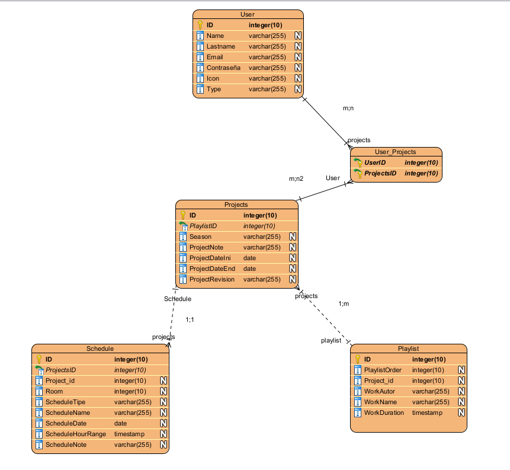
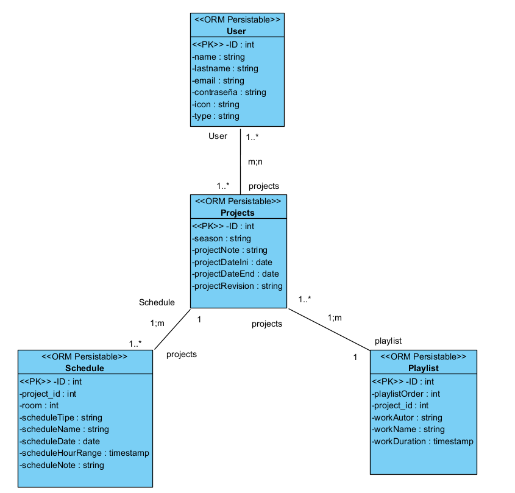
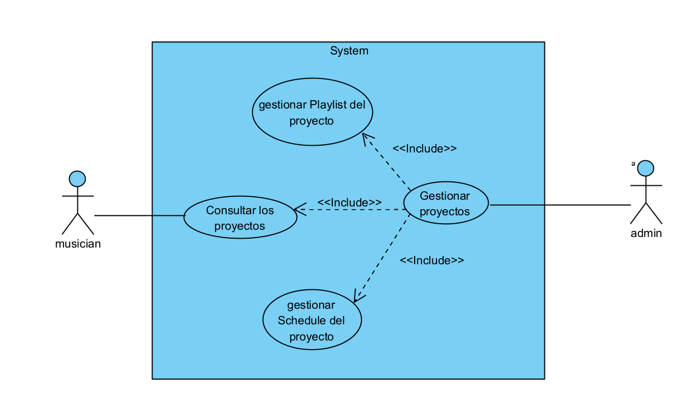

# Usabi_Project

OrquestaApp is an application designed to assist orchestra musicians in staying informed about scheduled concerts and associated music playlists.

## Table of Contents

- [Overview](#overview)
- [Prerequisites](#prerequisites)
- [Installation](#installation)
- [Usage](#usage)
- [Configuration](#configuration)
- [Contributing](#contributing)
- [Postman Documentation](#postman-documentation)
- [Models](#models)

## Overview

OrquestaApp consists of a Ruby on Rails backend and a React frontend. This README provides information on how to set up the development environment, install dependencies, and contribute to the project.

## Prerequisites
Ruby on Rails: Rails 7.1.2 /Ruby 3.0.0
Node.js and npm (or Yarn): Last version
PostgreSQL: Last version

## Installation
Clone this repository: git clone: https://github.com/MiguelAngelHGProjects/Usabi_Project.git
Navigate to the project directory: cd Usabi_Project
Install backend dependencies: bundle install
Install frontend dependencies: npm install (or yarn install if using Yarn)  

## Usage
Start the backend server: rails server
Start the frontend development server: npm start (or yarn start)
Open your browser and visit http://localhost:3000

## Configuration

Configure your PostgreSQL database:

- Open your `config/aplication.yml` file
- Update the `username`, `password`, and `database` values with your own PostgreSQL credentials

## Contributing

Contributions are welcome! If you want to contribute to the project, follow these steps:

Fork the repository.
Create a branch for your contribution: git checkout -b feature/new-feature
Make your changes and commit: git commit -m 'Add new feature'
Push to your branch: git push origin feature/new-feature
Open a Pull Request on GitHub.

## Models 

## Postman Documentation
https://documenter.getpostman.com/view/29847204/2s9YkhhjqE