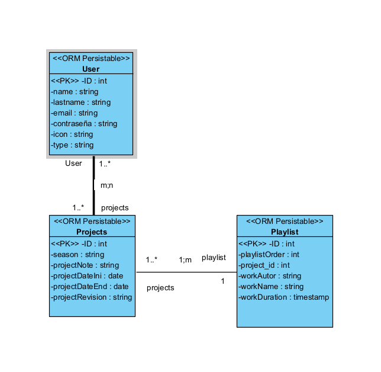
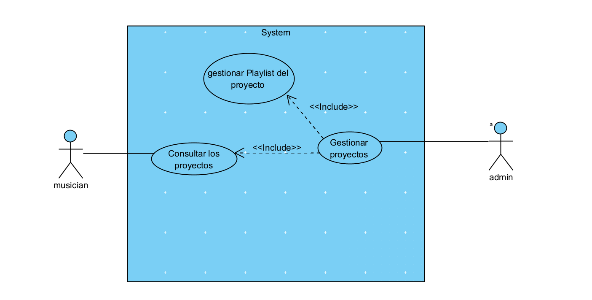

# Usabi_Project

## Table of Contents

- [Overview](#overview)
- [Technology Stack](#technology-stack)
- [Prerequisites](#prerequisites)
- [Installation](#installation)
- [Postman Documentation](#postman-documentation)   
- [Figma style](#figma-style)   
- [Usage](#usage)
- [Configuration](#configuration)
- [Models](#models)
- [Technology comparison](#technology-comparison)
- [Planification](#planification)
- [Conclusion](#conclusion)
- [User manual](#user-manual)

## Overview

- Usabi_Project is an application designed to assist orchestra musicians in staying informed about scheduled concerts and associated music playlists.

- Usabi_Project consists of a Ruby on Rails backend and a React frontend. This README provides information on how to set up the development environment, install dependencies, and contribute to the project.

- The users mostly can see only de proyects and the other information about playlists and their relation but not create, delete or update something of everything.

- The idea of this application arose from the need of OFGC musicians to organize their projects and concerts.

- This application had originally been developed for the OFGC company but due to a change the idea was taken to create it for the Usabi company using different technologies to adapt it to that company

## Technology Stack
Ruby on Rails https://rubyonrails.org/
Node.js https://nodejs.org/en
PostgresSQL https://www.postgresql.org/
ReactJS https://react.dev/

## Prerequisites
Ruby on Rails: Rails 7.1.2 /Ruby 3.0.0
Node.js and npm (or Yarn): Last version
PostgreSQL: Last version

## Installation
Clone this repository: git clone: https://github.com/MiguelAngelHGProjects/Usabi_Project.git
Navigate to the project directory: cd Usabi_Project
Install backend dependencies: bundle install
Install frontend dependencies: npm install (or yarn install if using Yarn)  

## Postman Documentation
https://documenter.getpostman.com/view/29847204/2s9YkhhjqE

## Figma style
- https://www.figma.com/file/ZNQtIRRKhOMOLfblaa2AVd/Usabi_Project?type=design&node-id=0-1&mode=design

## Usage
Start the backend server: rails server
Start the frontend development server: npm start (or yarn start)
Open your browser and visit http://localhost:3000

## Configuration

Configure your PostgreSQL database:

- Open your `config/aplication.yml` file
- Update the `username`, `password`, and `database` values with your own PostgreSQL credentials

## Models 
- E/R model

- Class diagram

- Use cases

- Model

## Technology comparison
- If I had been given the opportunity to choose technology, for this type of application I would have used technologies such as ionic and spring to carry out both the frontend and the backend since I would not have needed to use technologies as powerful as ruby on rails to develop it

## Planification
- To develop this application, the planning that has been used has been to separate the project into parts of the same size into separate issues.

- Mainly scrums are used to separate problems or issues into several days and using Github branches next to the tasks to separate the issues.

## Conclusion
- Throughout this project I have learned to use several quite interesting and very powerful technologies when it comes to development.

## User manual
- Once the user enters the application and registers, they will be able to see the projects created by the administrators and by clicking on the different sections of the menu we will be able to see the playlists and the relationships that the users have with the projects to which they are assigned.